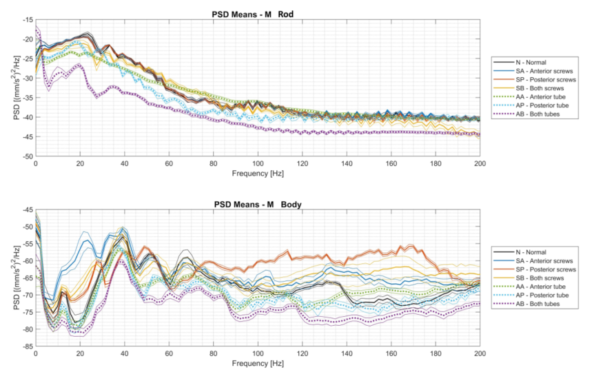

# Review: Condition Monitoring of Pneumatic Drive Systems Based on the AI Method Feed-forward Backpropagation Neural Network
- Monica Tiboni & Carlo Remino

### Abstract
- Compares results obtained with different sensors and features as input
- Features: PSD and statistical indices (time-domain)
- Possible to condition monitoring, increase uptake of maintanance approach
- This paper use PSD, FFT and statistics and aim for the statistics set that robust enough

### Introduction - Related Works
- Goal: not only increase availability but also reduce planned maintainance and extend life
- ANN can model highly nonlinear systems. Machine considered black box

- <paper 24> De Freitas 2 Networks: model (predict) and classifier (compare signal)
- <paper 25 26> K S identified: incorrect pressure, diaphragm leakage, and vent blockage using 9 features. Feature valve respond to step command
- <paper 27 28 29> S K detected 19 faults, reduce input size using PCA and compare to ANFIS
- <paper 30> Benchmark of 19 faults. Control Valve, Servo, Positioner, General/External Faults
- <paper 31> Kourd follow Freitas but errors identified based on Euclidean distance
- <paper 32> Deng follow K S (7 features from step response of valve), 
- <paper 33> S K reduce input with PCA
- <paper 34 35> Prabakaran initial system similar to Kourd, then improve with KSOM adapt real-time observed
- <paper 36> K K confirmed PCA in improving accuracy
- <paper 37> Andrade Networks: NARX to predict state and a classifier for each faults then identify with tree
- <paper 38> Demetgul NN to detect faults in entire system. Compared 2 method: supervised-unsupervised (11 faults from 8 signals from sensors)
- Several authors suggested: closest neighbor interpolation, SMOTE, GANs, random oversampling and others. FEM, WPT, SVM,...

### Methodology
- Method:
    - Data collections: test setup or running machine
    - Features: Time/Frequency/Time-Frequency
    - Net training
    - Health state recognition (and retraining based on real data)
- Setup sensor: Rod - Body - Z - All
- Setup faults: Loosened screw and air leak

- Compare: PSD and FFT most commonly used, research choose PSD (image: Rod Body)
- Compare: RMS, skewness and kurtosis considered (image: Rod Body Z All)
- Peak and crest depend on sampling frequency which may not true if frequency is low
- Compare: Max PSD Frequency - Neurons (image: Rod Body)
- Compare: Features - Neurons (image: Rod Body Z All)

### Results, Conclusion
- "body" higher accuracy, but "rod" sensors with high PSD and sufficient neurons can achieve perfect classification
- Statistical features "body" monoaxial sensor high accurate and reliable fault detection, "rod" and Arduino are less effective
- Evaluating using weighted error rather than raw accuracy
- Monoaxial "body" using Z-axis signals with 150 Hz PSD and 80% data outperform Arduino sensors in classification errors
- Statistical features "body" make less critical errors, even with less training data

- Proper way to evaluate results
