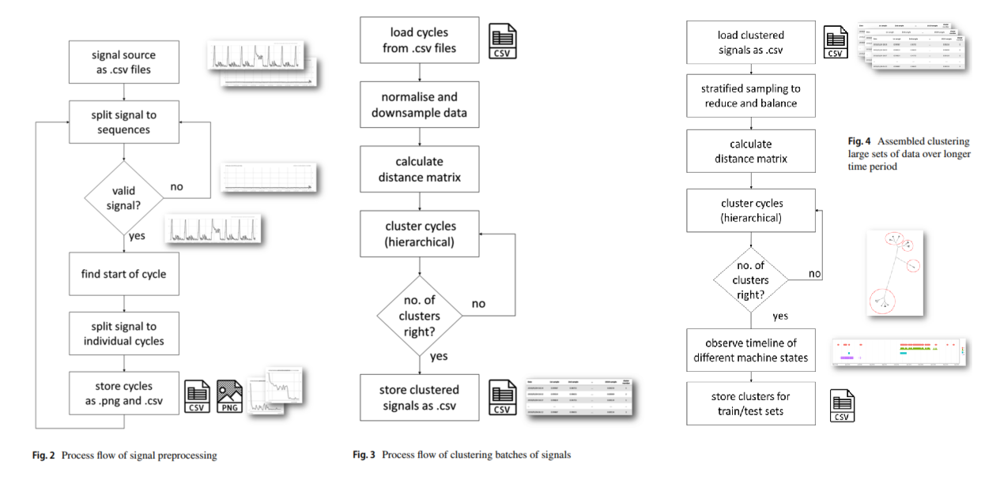
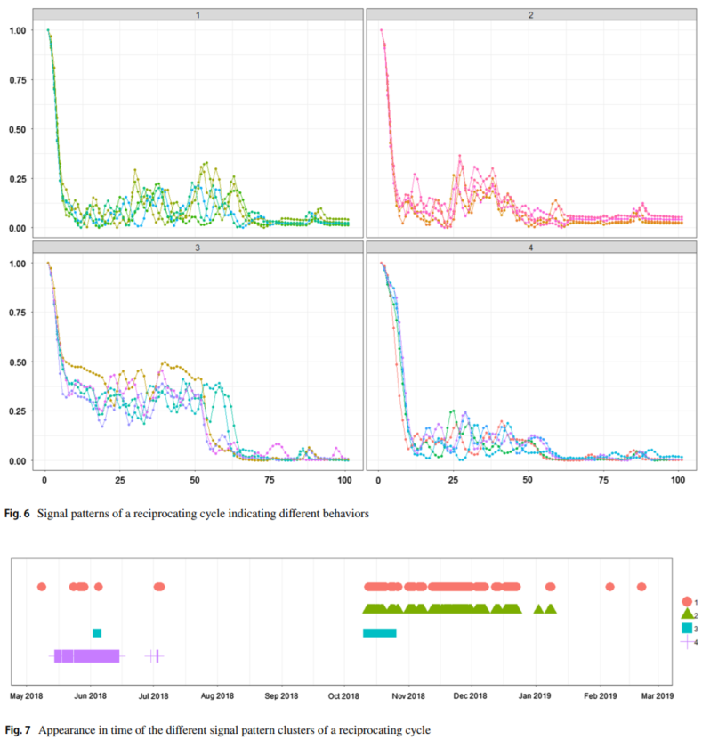

# Review: Monitoring Pneumatic Actuators' Behavior Using Real-World Data Set
- Tibor Kovac & Andrea Ko

### Abstract
- Preprocessing: Peak detection, remove ideling states, down-sampling
- Clustering: hierarchical (Euclidean distance) and Kohonen self-organizing map - Detect and monitoring easier
- Prove that signal from accelerometer can be train and monitoring

### Introduction - Related Works
- Approach to identify and classify different machine states by analyzing signal patterns
- Preprocessing signals from real-world data
- Create balance training set, predict error to raise early warning

<paper 1 2> Sensor fault detection  
<paper 12 13> Fault prediction  
<paper 14 15> Main steps: signal acquire, feature extract and classify  
<paper 16> Signal extract features  
<paper 17> Clustering-Distance evaluate  
<paper 24> Clustering goal  
<paper 26 27 28 29 30> Imbalance class distribution such as fault indentify, network intrusion, sentiment, fraud detect and approach  
<paper 32 33 34> Clustering approach  
<paper 35> Signal non-stationary  

### Methodology - Works
- Hybrid methods: unsupervised learning as data preprocessing for supervised learning
- Supervised learning fits well, Unsupervised learning goal is to discover unknown classes of items by clustering
- Imbalance class distribution: where significantly more intances from one class, lead to misclassify instances of less represented

- Data process flow, with used methodology

- KSOM used to monitoring (Clustering make monitoring easier)

- Pattern recognition: analyzing signals from pneumatic actuator realiable, cheap and able to detect wear tear
- Signal 0-20mV collected, down-sampling from 7.8e-5 to 1.4e-2 by interpolation, only keep operating (not idling signal) of 6-8 cycles
- External_conditions: Mainly compressed air pressure, affect cycle time and signal amplitude. Cycle time off by 1% (Jamming, ...)

- Preprocessing: Find start of cycle to split cycles, remove ideling states
- Clustering: Normalize and downsample, calculate distance matrix, cluster cycles hierarchical to a number
    - Euclidean distance to calculate dissimilarity matrix as input for clustering, 20000 signals per batch (based on computer)
    - Numbers of cluster (4) evaluated by experts
    - Clustering using fastcluster R package applying
- Assembled clustering: stratified sampling to reduce and balance, calculate distance matrix, cluster, observe timeline of different states

### Results, Conclusion
- It works, small deflect can even can be monitoring after clustering
- KSOM and clustering resulted the same. In KSOM we need to define dimension and harder to visualize however KSOM faster
- Under sampling (interpolar) can be finetune in the future
